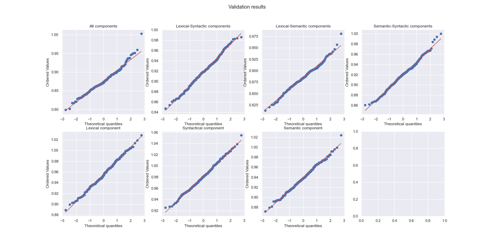

# Classification metrics results
## Training and valudation accuracy qqplots

## Accuracy

Mean and standard deviation for the obtained accuracy for training and validation of text classification. By using all components of text better results are achieved.

<table>
<thead>
  <tr>
    <th colspan="5">Accuracy</th>
  </tr>
   <tr>
    <td rowspan="2"><b>Used components</b></td>
    <td colspan="2"><b>Training set</b></td>
    <td colspan="2"><b>Validation set</b></td>
  </tr>
  <tr>
    <td>&mu;</td>
    <td>&sigma;</td>
    <td>&mu;</td>
    <td>&sigma;</td>
  </tr>
</thead>
<tbody>
  <tr>
    <td>Full</td>
    <td><b>0.8706</b></td>
    <td>0.0371</td>
    <td><b>0.5325</b></td>
    <td>0.0765</td>
  </tr>
  <tr>
    <td>Lexical-Syntactic</td>
    <td>0.7121</td>
    <td>0.0376</td>
    <td>0.4912</td>
    <td>0.0687</td>
  </tr>
  <tr>
    <td>Lexical-Semantic</td>
    <td>0.8045</td>
    <td>0.0402</td>
    <td>0.5020</td>
    <td>0.0707</td>
  </tr>
  <tr>
    <td>Syntactic-Semantic</td>
    <td>0.8579</td>
    <td>0.0413</td>
    <td>0.4820</td>
    <td>0.0716</td>
  </tr>
  <tr>
    <td>Lexical</td>
    <td>0.4654</td>
    <td>0.0270</td>
    <td>0.4504</td>
    <td>0.0626</td>
  </tr>
  <tr>
    <td>Syntactic</td>
    <td>0.6701</td>
    <td>0.0495</td>
    <td>0.4772</td>
    <td>0.0703</td>
  </tr>
  <tr>
    <td>Semantic</td>
    <td>0.8067</td>
    <td>0.0574</td>
    <td>0.4926</td>
    <td>0.0748</td>
  </tr>
</tbody>
</table>

## Accuracy t-tests
    
T-test results from the experiments. In all cases the p-value < .05, which reflects that there is a significant difference of accuracy between using all components of text and using one or two of them. Confidence intervals of the difference between means also reflect a positive difference in all cases showing also that higher accuracy values are reached by using all components simultaneously.

<table>
<thead>
  <tr>
    <th colspan="5">Accuracy t-tests</th>
  </tr>
  <tr>
    <th rowspan="2"><b>Component comparison</b></th>
    <th colspan="2"><b>Training set</b></th>
    <th colspan="2"><b>Validation set</b></th>
  </tr>
  <tr>
    <td>p-val</td>
    <td>CI 95%</td>
    <td>p-val</td>
    <td>CI 95%</td>
  </tr>
</thead>
<tbody>
  <tr>
    <td>Full vs. Lexical</td>
    <td>&lt;.001</td>
    <td>[0.4, 0.41]</td>
    <td>&lt;.001</td>
    <td>[0.04, 0.06]</td>
  </tr>
  <tr>
    <td>Full vs. Syntactic</td>
    <td>&lt;.001</td>
    <td>[0.2, 0.21]</td>
    <td>&lt;.001</td>
    <td>[0.02, 0.03]</td>
  </tr>
  <tr>
    <td>Full vs. Semantic</td>
    <td>&lt;.001</td>
    <td>[0.06, 0.07]</td>
    <td>.042</td>
    <td>[0.0, 0.02]</td>
  </tr>
  <tr>
    <td>Full vs. Lexical-Syntactic</td>
    <td>&lt;.001</td>
    <td>[0.15, 0.16]</td>
    <td>.014</td>
    <td>[0.0, 0.02]</td>
  </tr>
  <tr>
    <td>Full vs. Lexical-Semantic</td>
    <td>&lt;.001</td>
    <td>[0.06, 0.07]</td>
    <td>&lt;.001</td>
    <td>[0.02, 0.04]</td>
  </tr>
  <tr>
    <td>Full vs. Syntactic-Semantic</td>
    <td>&lt;.001</td>
    <td>[0.01, 0.02]</td>
    <td>&lt;.001</td>
    <td>[0.01, 0.03]</td>
  </tr>
</tbody>
</table>

## Precision (micro and macro average)

<table>
<thead>
  <tr>
    <th colspan="5">Micro Precision</th>
  </tr>
   <tr>
    <td rowspan="2"><b>Used components</b></td>
    <td colspan="2"><b>Training set</b></td>
    <td colspan="2"><b>Validation set</b></td>
  </tr>
  <tr>
    <td>&mu;</td>
    <td>&sigma;</td>
    <td>&mu;</td>
    <td>&sigma;</td>
  </tr>
</thead>
<tbody>
  
  <tr>
    <td>Full</td>
    <td><b>0.9095</b></td>
    <td>0.0336</td>
    <td><b>0.5325</b></td>
    <td>0.0765</td>
  </tr>
  <tr>
    <td>Lexical-Syntactic</td>
    <td>0.7566</td>
    <td>0.0350</td>
    <td>0.4912</td>
    <td>0.0687</td>
  </tr>
  <tr>
    <td>Lexical-Semantic</td>
    <td>0.8484</td>
    <td>0.0378</td>
    <td>0.5020</td>
    <td>0.0707</td>
  </tr>
  <tr>
    <td>Syntacitc-Semantic</td>
    <td>0.9003</td>
    <td>0.0368</td>
    <td>0.4820</td>
    <td>0.0716</td>
  </tr>
  <tr>
    <td>Lexical</td>
    <td>0.4825</td>
    <td>0.0238</td>
    <td>0.4504</td>
    <td>0.0626</td>
  </tr>
  <tr>
    <td>Syntactic</td>
    <td>0.7063</td>
    <td>0.0511</td>
    <td>0.4772</td>
    <td>0.0703</td>
  </tr>
  <tr>
    <td>Semantic</td>
    <td>0.8485</td>
    <td>0.0526</td>
    <td>0.4926</td>
    <td>0.0748</td>
  </tr>
</tbody>
</table>

<table>
<thead>
  <tr>
    <th colspan="5">Micro precision t-tests</th>
  </tr>
  <tr>
    <td rowspan="2"><b>Component comparison</b></td>
    <td colspan="2"><b>Training set</b></td>
    <td colspan="2"><b>Validation set</b></td>
  </tr>
  <tr>
    <td>p-val</td>
    <td>CI 95%</td>
    <td>p-val</td>
    <td>CI 95%</td>
  </tr>
</thead>
<tbody>

  <tr>
    <td>Full vs. Lexical</td>
    <td>&lt;.001</td>
    <td>[0.42, 0.43]</td>
    <td>&lt;.001</td>
    <td>[0.04, 0.06]</td>
  </tr>
  <tr>
    <td>Full vs. Syntactic</td>
    <td>&lt;.001</td>
    <td>[0.2, 0.21]</td>
    <td>&lt;.001</td>
    <td>[0.02, 0.03]</td>
  </tr>
  <tr>
    <td>Full vs. Semantic</td>
    <td>&lt;.001</td>
    <td>[0.06, 0.07]</td>
    <td>0.042</td>
    <td>[0.0, 0.02]</td>
  </tr>
  <tr>
    <td>Full vs. Lexical-Syntactic</td>
    <td>&lt;.001</td>
    <td>[0.15, 0.16]</td>
    <td>0.014</td>
    <td>[0.0, 0.02]</td>
  </tr>
  <tr>
    <td>Full vs. Lexical-Semantic</td>
    <td>&lt;.001</td>
    <td>[0.06, 0.07]</td>
    <td>&lt;.001</td>
    <td>[0.02, 0.04]</td>
  </tr>
  <tr>
    <td>Full vs. Syntactic-Semantic</td>
    <td>&lt;.001</td>
    <td>[0.0, 0.01]</td>
    <td>&lt;.001</td>
    <td>[0.01, 0.03]</td>
  </tr>
</tbody>
</table>

<table>
<thead>
  <tr>
    <th colspan="5">Macro Precision</th>
  </tr>
  <tr>
    <td rowspan="2"><b>Used components</b></td>
    <td colspan="2"><b>Training set</b></td>
    <td colspan="2"><b>Validation set</b></td>
  </tr>
  <tr>
    <td>&mu;</td>
    <td>&sigma;</td>
    <td>&mu;</td>
    <td>&sigma;</td>
  </tr>
</thead>
<tbody>
  <tr>
    <td>Full</td>
    <td><b>0.9232</b></td>
    <td>0.0300</td>
    <td><b>0.5311</b></td>
    <td>0.106</td>
  </tr>
  <tr>
    <td>Lexical-Syntactic</td>
    <td>0.7898</td>
    <td>0.0399</td>
    <td>0.4782</td>
    <td>0.1015</td>
  </tr>
  <tr>
    <td>Lexical-Semantic</td>
    <td>0.8615</td>
    <td>0.0370</td>
    <td>0.5069</td>
    <td>0.1034</td>
  </tr>
  <tr>
    <td>Syntacitc-Semantic</td>
    <td>0.9126</td>
    <td>0.0317</td>
    <td>0.4462</td>
    <td>0.0981</td>
  </tr>
  <tr>
    <td>Lexical</td>
    <td>0.3811</td>
    <td>0.0520</td>
    <td>0.3388</td>
    <td>0.0999</td>
  </tr>
  <tr>
    <td>Syntactic</td>
    <td>0.7464</td>
    <td>0.0614</td>
    <td>0.4334</td>
    <td>0.1013</td>
  </tr>
  <tr>
    <td>Semantic</td>
    <td>0.8624</td>
    <td>0.0537</td>
    <td>0.4333</td>
    <td>0.0955</td>
  </tr>
</tbody>
</table>

<table>
<thead>
  <tr>
    <th colspan="5">Macro precision t-tests</th>
  </tr>
  <tr>
    <td rowspan="2"><b>Component comparison</b></td>
    <td colspan="2"><b>Training set</b></td>
    <td colspan="2"><b>Validation set</b></td>
  </tr>
  <tr>
    <td>p-val</td>
    <td>CI 95%</td>
    <td>p-val</td>
    <td>CI 95%</td>
  </tr>
</thead>
<tbody>
  <tr>
    <td>Full vs. Lexical</td>
    <td>&lt;.001</td>
    <td>[0.54, 0.55]</td>
    <td>&lt;.001</td>
    <td>[0.16, 0.18]</td>
  </tr>
  <tr>
    <td>Full vs. Syntactic</td>
    <td>&lt;.001</td>
    <td>[0.17, 0.18]</td>
    <td>&lt;.001</td>
    <td>[0.06, 0.09]</td>
  </tr>
  <tr>
    <td>Full vs. Semantic</td>
    <td>&lt;.001</td>
    <td>[0.06, 0.07]</td>
    <td>&lt;.001</td>
    <td>[0.06, 0.09]</td>
  </tr>
  <tr>
    <td>Full vs. Lexical-Syntactic</td>
    <td>&lt;.001</td>
    <td>[0.13, 0.14]</td>
    <td>&lt;.001</td>
    <td>[0.02, 0.04]</td>
  </tr>
  <tr>
    <td>Full vs. Lexical-Semantic</td>
    <td>&lt;.001</td>
    <td>[0.06, 0.07]</td>
    <td>&lt;.001</td>
    <td>[0.01, 0.04]</td>
  </tr>
  <tr>
    <td>Full vs. Syntactic-Semantic</td>
    <td>&lt;.001</td>
    <td>[0.01, 0.01]</td>
    <td>&lt;.001</td>
    <td>[0.05, 0.07]</td>
  </tr>
</tbody>
</table>

## Recall (micro and macro average)

<table>
<thead>
  <tr>
    <th colspan="5">Micro Recall</th>
  </tr>
   <tr>
    <td rowspan="2"><b>Used components</b></td>
    <td colspan="2"><b>Training set</b></td>
    <td colspan="2"><b>Validation set</b></td>
  </tr>
  <tr>
    <td>&mu;</td>
    <td>&sigma;</td>
    <td>&mu;</td>
    <td>&sigma;</td>
  </tr>
</thead>
<tbody>
  <tr>
    <td>Full</td>
    <td><b>0.9095</b></td>
    <td>0.0336</td>
    <td><b>0.5325</b></td>
    <td>0.0765</td>
  </tr>
  <tr>
    <td>Lexical-Syntactic</td>
    <td>0.7566</td>
    <td>0.0350</td>
    <td>0.4912</td>
    <td>0.0687</td>
  </tr>
  <tr>
    <td>Lexical-Semantic</td>
    <td>0.8484</td>
    <td>0.0378</td>
    <td>0.5020</td>
    <td>0.0707</td>
  </tr>
  <tr>
    <td>Syntacitc-Semantic</td>
    <td>0.9003</td>
    <td>0.0368</td>
    <td>0.4820</td>
    <td>0.0716</td>
  </tr>
  <tr>
    <td>Lexical</td>
    <td>0.4825</td>
    <td>0.0238</td>
    <td>0.4504</td>
    <td>0.0626</td>
  </tr>
  <tr>
    <td>Syntactic</td>
    <td>0.7063</td>
    <td>0.0511</td>
    <td>0.4772</td>
    <td>0.0703</td>
  </tr>
  <tr>
    <td>Semantic</td>
    <td>0.8485</td>
    <td>0.0526</td>
    <td>0.4926</td>
    <td>0.0748</td>
  </tr>
</tbody>
</table>

<table>
<thead>
  <tr>
    <th colspan="5">Micro recall t-tests</th>
  </tr>
  <tr>
    <td rowspan="2"><b>Component comparison</b></td>
    <td colspan="2"><b>Training set</b></td>
    <td colspan="2"><b>Validation set</b></td>
  </tr>
  <tr>
    <td>p-val</td>
    <td>CI 95%</td>
    <td>p-val</td>
    <td>CI 95%</td>
  </tr>
</thead>
<tbody>
  <tr>
    <td>Full vs. Lexical</td>
    <td>&lt;.001</td>
    <td>[0.42, 0.43]</td>
    <td>&lt;.001</td>
    <td>[0.04, 0.06]</td>
  </tr>
  <tr>
    <td>Full vs. Syntactic</td>
    <td>&lt;.001</td>
    <td>[0.2, 0.21]</td>
    <td>&lt;.001</td>
    <td>[0.02, 0.03]</td>
  </tr>
  <tr>
    <td>Full vs. Semantic</td>
    <td>&lt;.001</td>
    <td>[0.06, 0.07]</td>
    <td>0.042</td>
    <td>[0.0, 0.02]</td>
  </tr>
  <tr>
    <td>Full vs. Lexical-Syntactic</td>
    <td>&lt;.001</td>
    <td>[0.15, 0.16]</td>
    <td>0.014</td>
    <td>[0.0, 0.02]</td>
  </tr>
  <tr>
    <td>Full vs. Lexical-Semantic</td>
    <td>&lt;.001</td>
    <td>[0.06, 0.07]</td>
    <td>&lt;.001</td>
    <td>[0.02, 0.04]</td>
  </tr>
  <tr>
    <td>Full vs. Syntactic-Semantic</td>
    <td>&lt;.001</td>
    <td>[0.0, 0.01]</td>
    <td>&lt;.001</td>
    <td>[0.01, 0.03]</td>
  </tr>
</tbody>
</table>

<table>
<thead>
  <tr>
    <th colspan="5">Macro Recall</th>
  </tr>
  <tr>
    <td rowspan="2"><b>Used components</b></td>
    <td colspan="2"><b>Training set</b></td>
    <td colspan="2"><b>Validation set</b></td>
  </tr>
  <tr>
    <td>&mu;</td>
    <td>&sigma;</td>
    <td>&mu;</td>
    <td>&sigma;</td>
  </tr>
</thead>
<tbody>
  <tr>
    <td>Full</td>
    <td><b>0.9087</b></td>
    <td>0.0373</td>
    <td><b>0.5073</b></td>
    <td>0.0841</td>
  </tr>
  <tr>
    <td>Lexical-Syntactic</td>
    <td>0.7429</td>
    <td>0.0436</td>
    <td>0.4679</td>
    <td>0.0782</td>
  </tr>
  <tr>
    <td>Lexical-Semantic</td>
    <td>0.8371</td>
    <td>0.0469</td>
    <td>0.4872</td>
    <td>0.0814</td>
  </tr>
  <tr>
    <td>Syntacitc-Semantic</td>
    <td>0.8849</td>
    <td>0.0441</td>
    <td>0.4424</td>
    <td>0.077</td>
  </tr>
  <tr>
    <td>Lexical</td>
    <td>0.3940</td>
    <td>0.0348</td>
    <td>0.3605</td>
    <td>0.0617</td>
  </tr>
  <tr>
    <td>Syntactic</td>
    <td>0.6667</td>
    <td>0.0598</td>
    <td>0.4341</td>
    <td>0.0735</td>
  </tr>
  <tr>
    <td>Semantic</td>
    <td>0.8151</td>
    <td>0.061</td>
    <td>0.4351</td>
    <td>0.0737</td>
  </tr>
</tbody>
</table>

<table>
<thead>
  <tr>
    <th colspan="5">Macro recall t-tests</th>
  </tr>
  <tr>
    <td rowspan="2"><b>Component comparison</b></td>
    <td colspan="2"><b>Training set</b></td>
    <td colspan="2"><b>Validation set</b></td>
  </tr>
  <tr>
    <td>p-val</td>
    <td>CI 95%</td>
    <td>p-val</td>
    <td>CI 95%</td>
  </tr>
</thead>
<tbody>
  <tr>
    <td>Full vs. Lexical</td>
    <td>&lt;.001</td>
    <td>[0.51, 0.52]</td>
    <td>&lt;.001</td>
    <td>[0.12, 0.14]</td>
  </tr>
  <tr>
    <td>Full vs. Syntactic</td>
    <td>&lt;.001</td>
    <td>[0.24, 0.25]</td>
    <td>&lt;.001</td>
    <td>[0.04, 0.06]</td>
  </tr>
  <tr>
    <td>Full vs. Semantic</td>
    <td>&lt;.001</td>
    <td>[0.09, 0.1]</td>
    <td>&lt;.001</td>
    <td>[0.04, 0.06]</td>
  </tr>
  <tr>
    <td>Full vs. Lexical-Syntactic</td>
    <td>&lt;.001</td>
    <td>[0.16, 0.17]</td>
    <td>&lt;.001</td>
    <td>[0.01, 0.03]</td>
  </tr>
  <tr>
    <td>Full vs. Lexical-Semantic</td>
    <td>&lt;.001</td>
    <td>[0.07, 0.08]</td>
    <td>&lt;.001</td>
    <td>[0.01, 0.03]</td>
  </tr>
  <tr>
    <td>Full vs. Syntactic-Semantic</td>
    <td>&lt;.001</td>
    <td>[0.02, 0.03]</td>
    <td>&lt;.001</td>
    <td>[0.03, 0.05]</td>
  </tr>
</tbody>
</table>

## F1 (micro and macro average)

<table>
<thead>
  <tr>
    <th colspan="5">Micro F1</th>
  </tr>
   <tr>
    <td rowspan="2"><b>Used components</b></td>
    <td colspan="2"><b>Training set</b></td>
    <td colspan="2"><b>Validation set</b></td>
  </tr>
  <tr>
    <td>&mu;</td>
    <td>&sigma;</td>
    <td>&mu;</td>
    <td>&sigma;</td>
  </tr>
</thead>
<tbody>  
  <tr>
    <td>Full</td>
    <td><b>0.9095</b></td>
    <td>0.0336</td>
    <td><b>0.5325</b></td>
    <td>0.0765</td>
  </tr>
  <tr>
    <td>Lexical-Syntactic</td>
    <td>0.7566</td>
    <td>0.0350</td>
    <td>0.4912</td>
    <td>0.0687</td>
  </tr>
  <tr>
    <td>Lexical-Semantic</td>
    <td>0.8484</td>
    <td>0.0378</td>
    <td>0.5020</td>
    <td>0.0707</td>
  </tr>
  <tr>
    <td>Syntacitc-Semantic</td>
    <td>0.9003</td>
    <td>0.0368</td>
    <td>0.4820</td>
    <td>0.0716</td>
  </tr>
  <tr>
    <td>Lexical</td>
    <td>0.4825</td>
    <td>0.0238</td>
    <td>0.4504</td>
    <td>0.0626</td>
  </tr>
  <tr>
    <td>Syntactic</td>
    <td>0.7063</td>
    <td>0.0511</td>
    <td>0.4772</td>
    <td>0.0703</td>
  </tr>
  <tr>
    <td>Semantic</td>
    <td>0.8485</td>
    <td>0.0526</td>
    <td>0.4926</td>
    <td>0.0748</td>
  </tr>
</tbody>
</table>

<table>
<thead>
  <tr>
    <th colspan="5">Micro F1 t-tests</th>
  </tr>
  <tr>
    <td rowspan="2"><b>Component comparison</b></td>
    <td colspan="2"><b>Training set</b></td>
    <td colspan="2"><b>Validation set</b></td>
  </tr>
  <tr>
    <td>p-val</td>
    <td>CI 95%</td>
    <td>p-val</td>
    <td>CI 95%</td>
  </tr>
</thead>
<tbody>
  <tr>
    <td>Full vs. Lexical</td>
    <td>&lt;.001</td>
    <td>[0.42, 0.43]</td>
    <td>&lt;.001</td>
    <td>[0.04, 0.06]</td>
  </tr>
  <tr>
    <td>Full vs. Syntactic</td>
    <td>&lt;.001</td>
    <td>[0.2, 0.21]</td>
    <td>&lt;.001</td>
    <td>[0.02, 0.03]</td>
  </tr>
  <tr>
    <td>Full vs. Semantic</td>
    <td>&lt;.001</td>
    <td>[0.06, 0.07]</td>
    <td>0.042</td>
    <td>[0.0, 0.02]</td>
  </tr>
  <tr>
    <td>Full vs. Lexical-Syntactic</td>
    <td>&lt;.001</td>
    <td>[0.15, 0.16]</td>
    <td>0.014</td>
    <td>[0.0, 0.02]</td>
  </tr>
  <tr>
    <td>Full vs. Lexical-Semantic</td>
    <td>&lt;.001</td>
    <td>[0.06, 0.07]</td>
    <td>&lt;.001</td>
    <td>[0.02, 0.04]</td>
  </tr>
  <tr>
    <td>Full vs. Syntactic-Semantic</td>
    <td>&lt;.001</td>
    <td>[0.0, 0.01]</td>
    <td>&lt;.001</td>
    <td>[0.01, 0.03]</td>
  </tr>
</tbody>
</table>

<table>
<thead>
  <tr>
    <th colspan="5">Macro F1</th>
  </tr>
  <tr>
    <td rowspan="2"><b>Used components</b></td>
    <td colspan="2"><b>Training set</b></td>
    <td colspan="2"><b>Validation set</b></td>
  </tr>
  <tr>
    <td>&mu;</td>
    <td>&sigma;</td>
    <td>&mu;</td>
    <td>&sigma;</td>
  </tr>
</thead>
<tbody>
  <tr>
    <td>Full</td>
    <td><b>0.9114</b></td>
    <td>0.0349</td>
    <td><b>0.4979</b></td>
    <td>0.0867</td>
  </tr>
  <tr>
    <td>Lexical-Syntactic</td>
    <td>0.7503</td>
    <td>0.0429</td>
    <td>0.4549</td>
    <td>0.0814</td>
  </tr>
  <tr>
    <td>Lexical-Semantic</td>
    <td>0.8424</td>
    <td>0.0438</td>
    <td>0.4768</td>
    <td>0.0846</td>
  </tr>
  <tr>
    <td>Syntacitc-Semantic</td>
    <td>0.8915</td>
    <td>0.0409</td>
    <td>0.4283</td>
    <td>0.0796</td>
  </tr>
  <tr>
    <td>Lexical</td>
    <td>0.3618</td>
    <td>0.0397</td>
    <td>0.3217</td>
    <td>0.0669</td>
  </tr>
  <tr>
    <td>Syntactic</td>
    <td>0.6715</td>
    <td>0.0655</td>
    <td>0.4145</td>
    <td>0.0755</td>
  </tr>
  <tr>
    <td>Semantic</td>
    <td>0.8258</td>
    <td>0.0616</td>
    <td>0.4186</td>
    <td>0.0776</td>
  </tr>
</tbody>
</table>

<table>
<thead>
  <tr>
    <th colspan="5">Macro F1 t-tests</th>
  </tr>
  <tr>
    <td rowspan="2"><b>Component comparison</b></td>
    <td colspan="2"><b>Training set</b></td>
    <td colspan="2"><b>Validation set</b></td>
  </tr>
  <tr>
    <td>p-val</td>
    <td>CI 95%</td>
    <td>p-val</td>
    <td>CI 95%</td>
  </tr>
</thead>
<tbody>
  <tr>
    <td>Full vs. Lexical</td>
    <td>&lt;.001</td>
    <td>[0.54, 0.55]</td>
    <td>&lt;.001</td>
    <td>[0.15, 0.16]</td>
  </tr>
  <tr>
    <td>Full vs. Syntactic</td>
    <td>&lt;.001</td>
    <td>[0.23, 0.25]</td>
    <td>&lt;.001</td>
    <td>[0.05, 0.07]</td>
  </tr>
  <tr>
    <td>Full vs. Semantic</td>
    <td>&lt;.001</td>
    <td>[0.08, 0.09]</td>
    <td>&lt;.001</td>
    <td>[0.05, 0.07]</td>
  </tr>
  <tr>
    <td>Full vs. Lexical-Syntactic</td>
    <td>&lt;.001</td>
    <td>[0.16, 0.17]</td>
    <td>&lt;.001</td>
    <td>[0.01, 0.03]</td>
  </tr>
  <tr>
    <td>Full vs. Lexical-Semantic</td>
    <td>&lt;.001</td>
    <td>[0.06, 0.07]</td>
    <td>&lt;.001</td>
    <td>[0.01, 0.03]</td>
  </tr>
  <tr>
    <td>Full vs. Syntactic-Semantic</td>
    <td>&lt;.001</td>
    <td>[0.02, 0.02]</td>
    <td>&lt;.001</td>
    <td>[0.04, 0.06]</td>
  </tr>
</tbody>
</table>

# Regression metrics results
## Training and validation root mean squared error qqplots

## Root mean squared error (RMSE)

<table>
<thead>
  <tr>
    <th colspan="5">Root mean squared error</th>
  </tr>
  <tr>
    <td rowspan="2"><b>Used components</b></td>
    <td colspan="2"><b>Training set</b></td>
    <td colspan="2"><b>Validation set</b></td>
  </tr>
  <tr>
    <td>&mu;</td>
    <td>&sigma;</td>
    <td>&mu;</td>
    <td>&sigma;</td>
  </tr>
</thead>
<tbody>
  <tr>
    <td>Full</td>
    <td><b>0.8714</b></td>
    <td>0.0094</td>
    <td><b>0.8758</b></td>
    <td>0.0287</td>
  </tr>
  <tr>
    <td>Lexical-Syntactic</td>
    <td>0.9182</td>
    <td>0.0078</td>
    <td>0.9179</td>
    <td>0.0269</td>
  </tr>
  <tr>
    <td>Lexical-Semantic</td>
    <td>0.8863</td>
    <td>0.0081</td>
    <td>0.8849</td>
    <td>0.0252</td>
  </tr>
  <tr>
    <td>Syntacitc-Semantic</td>
    <td>0.9062</td>
    <td>0.0076</td>
    <td>0.9199</td>
    <td>0.0252</td>
  </tr>
  <tr>
    <td>Lexical</td>
    <td>0.9613</td>
    <td>0.0070</td>
    <td>0.9552</td>
    <td>0.0252</td>
  </tr>
  <tr>
    <td>Syntactic</td>
    <td>0.9732</td>
    <td>0.0061</td>
    <td>0.9812</td>
    <td>0.0231</td>
  </tr>
  <tr>
    <td>Semantic</td>
    <td>0.9301</td>
    <td>0.0071</td>
    <td>0.9386</td>
    <td>0.0247</td>
  </tr>
</tbody>
</table>

<table>
<thead>
  <tr>
    <th colspan="5">Root mean squared error t-tests</th>
  </tr>
  <tr>
    <td rowspan="2"><b>Component comparison</b></td>
    <td colspan="2"><b>Training set</b></td>
    <td colspan="2"><b>Validation set</b></td>
  </tr>
  <tr>
    <td>p-val</td>
    <td>CI 95%</td>
    <td>p-val</td>
    <td>CI 95%</td>
  </tr>
</thead>
<tbody>
  <tr>
    <td>Full vs. Lexical</td>
    <td>&lt;.001</td>
    <td>[-0.09, -0.09]</td>
    <td>&lt;.001</td>
    <td>[-0.08, -0.07]</td>
  </tr>
  <tr>
    <td>Full vs. Syntactic</td>
    <td>&lt;.001</td>
    <td>[-0.1, -0.1]</td>
    <td>&lt;.001</td>
    <td>[-0.11, -0.1]</td>
  </tr>
  <tr>
    <td>Full vs. Semantic</td>
    <td>&lt;.001</td>
    <td>[-0.06, -0.06]</td>
    <td>&lt;.001</td>
    <td>[-0.07, -0.06]</td>
  </tr>
  <tr>
    <td>Full vs. Lexical-Syntactic</td>
    <td>&lt;.001</td>
    <td>[-0.05, -0.05]</td>
    <td>&lt;.001</td>
    <td>[-0.05, -0.04]</td>
  </tr>
  <tr>
    <td>Full vs. Lexical-Semantic</td>
    <td>&lt;.001</td>
    <td>[-0.02, -0.01]</td>
    <td>&lt;.001</td>
    <td>[-0.01, -0.0]</td>
  </tr>
  <tr>
    <td>Full vs. Syntactic-Semantic</td>
    <td>&lt;.001</td>
    <td>[-0.04, -0.03]</td>
    <td>&lt;.001</td>
    <td>[-0.05, -0.04]</td>
  </tr>
</tbody>
</table>

## Mean absolute error (MAE)

<table>
<thead>
  <tr>
    <th colspan="5">Mean absolute error</th>
  </tr>
  <tr>
    <td rowspan="2"><b>Used components</b></td>
    <td colspan="2"><b>Training set</b></td>
    <td colspan="2"><b>Validation set</b></td>
  </tr>
  <tr>
    <td>&mu;</td>
    <td>&sigma;</td>
    <td>&mu;</td>
    <td>&sigma;</td>
  </tr>
</thead>
<tbody>
  <tr>
    <td>Full</td>
    <td><b>0.6885</b></td>
    <td>0.0159</td>
    <td><b>0.7029</b></td>
    <td>0.0243</td>
  </tr>
  <tr>
    <td>Lexical-Syntactic</td>
    <td>0.7275</td>
    <td>0.0117</td>
    <td>0.7364</td>
    <td>0.0231</td>
  </tr>
  <tr>
    <td>Lexical-Semantic</td>
    <td>0.7035</td>
    <td>0.0108</td>
    <td>0.7121</td>
    <td>0.0218</td>
  </tr>
  <tr>
    <td>Syntacitc-Semantic</td>
    <td>0.7221</td>
    <td>0.0104</td>
    <td>0.7411</td>
    <td>0.0229</td>
  </tr>
  <tr>
    <td>Lexical</td>
    <td>0.7710</td>
    <td>0.0097</td>
    <td>0.7723</td>
    <td>0.0216</td>
  </tr>
  <tr>
    <td>Syntactic</td>
    <td>0.7821</td>
    <td>0.0090</td>
    <td>0.7939</td>
    <td>0.021</td>
  </tr>
  <tr>
    <td>Semantic</td>
    <td>0.7463</td>
    <td>0.0090</td>
    <td>0.7591</td>
    <td>0.022</td>
  </tr>
</tbody>
</table>

<table>
<thead>
  <tr>
    <th colspan="5">Mean absolute error t-tests</th>
  </tr>
  <tr>
    <td rowspan="2"><b>Component comparison</b></td>
    <td colspan="2"><b>Training set</b></td>
    <td colspan="2"><b>Validation set</b></td>
  </tr>
  <tr>
    <td>p-val</td>
    <td>CI 95%</td>
    <td>p-val</td>
    <td>CI 95%</td>
  </tr>
</thead>
<tbody>
  <tr>
    <td>Full vs. Lexical</td>
    <td>&lt;.001</td>
    <td>[-0.08, -0.08]</td>
    <td>&lt;.001</td>
    <td>[-0.07, -0.07]</td>
  </tr>
  <tr>
    <td>Full vs. Syntactic</td>
    <td>&lt;.001</td>
    <td>[-0.1, -0.09]</td>
    <td>&lt;.001</td>
    <td>[-0.1, -0.09]</td>
  </tr>
  <tr>
    <td>Full vs. Semantic</td>
    <td>&lt;.001</td>
    <td>[-0.06, -0.06]</td>
    <td>&lt;.001</td>
    <td>[-0.06, -0.05]</td>
  </tr>
  <tr>
    <td>Full vs. Lexical-Syntactic</td>
    <td>&lt;.001</td>
    <td>[-0.04, -0.04]</td>
    <td>&lt;.001</td>
    <td>[-0.04, -0.03]</td>
  </tr>
  <tr>
    <td>Full vs. Lexical-Semantic</td>
    <td>&lt;.001</td>
    <td>[-0.02, -0.01]</td>
    <td>&lt;.001</td>
    <td>[-0.01, -0.01]</td>
  </tr>
  <tr>
    <td>Full vs. Syntactic-Semantic</td>
    <td>&lt;.001</td>
    <td>[-0.04, -0.03]</td>
    <td>&lt;.001</td>
    <td>[-0.04, -0.03]</td>
  </tr>
</tbody>
</table>

## Mean squared error (MSE)

<table>
<thead>
  <tr>
    <th colspan="5">Mean squared error</th>
  </tr>
  <tr>
    <td rowspan="2"><b>Used components</b></td>
    <td colspan="2"><b>Training set</b></td>
    <td colspan="2"><b>Validation set</b></td>
  </tr>
  <tr>
    <td>&mu;</td>
    <td>&sigma;</td>
    <td>&mu;</td>
    <td>&sigma;</td>
  </tr>
</thead>
<tbody>
  <tr>
    <td>Full</td>
    <td><b>0.7359</b></td>
    <td>0.0333</td>
    <td><b>0.7679</b></td>
    <td>0.0508</td>
  </tr>
  <tr>
    <td>Lexical-Syntactic</td>
    <td>0.8237</td>
    <td>0.0264</td>
    <td>0.8433</td>
    <td>0.0495</td>
  </tr>
  <tr>
    <td>Lexical-Semantic</td>
    <td>0.7646</td>
    <td>0.0227</td>
    <td>0.7837</td>
    <td>0.0448</td>
  </tr>
  <tr>
    <td>Syntacitc-Semantic</td>
    <td>0.8028</td>
    <td>0.0232</td>
    <td>0.8469</td>
    <td>0.0465</td>
  </tr>
  <tr>
    <td>Lexical</td>
    <td>0.9100</td>
    <td>0.0191</td>
    <td>0.9130</td>
    <td>0.0483</td>
  </tr>
  <tr>
    <td>Syntactic</td>
    <td>0.9345</td>
    <td>0.0196</td>
    <td>0.9633</td>
    <td>0.0454</td>
  </tr>
  <tr>
    <td>Semantic</td>
    <td>0.8520</td>
    <td>0.0201</td>
    <td>0.8816</td>
    <td>0.0465</td>
  </tr>
</tbody>
</table>

<table>
<thead>
  <tr>
    <th colspan="5">Mean squared error t-tests</th>
  </tr>
  <tr>
    <td rowspan="2"><b>Component comparison</b></td>
    <td colspan="2"><b>Training set</b></td>
    <td colspan="2"><b>Validation set</b></td>
  </tr>
  <tr>
    <td>p-val</td>
    <td>CI 95%</td>
    <td>p-val</td>
    <td>CI 95%</td>
  </tr>
</thead>
<tbody>
  <tr>
    <td>Full vs. Lexical</td>
    <td>&lt;.001</td>
    <td>[-0.18, -0.17]</td>
    <td>&lt;.001</td>
    <td>[-0.15, -0.14]</td>
  </tr>
  <tr>
    <td>Full vs. Syntactic</td>
    <td>&lt;.001</td>
    <td>[-0.2, -0.19]</td>
    <td>&lt;.001</td>
    <td>[-0.2, -0.19]</td>
  </tr>
  <tr>
    <td>Full vs. Semantic</td>
    <td>&lt;.001</td>
    <td>[-0.12, -0.11]</td>
    <td>&lt;.001</td>
    <td>[-0.12, -0.11]</td>
  </tr>
  <tr>
    <td>Full vs. Lexical-Syntactic</td>
    <td>&lt;.001</td>
    <td>[-0.09, -0.08]</td>
    <td>&lt;.001</td>
    <td>[-0.08, -0.07]</td>
  </tr>
  <tr>
    <td>Full vs. Lexical-Semantic</td>
    <td>&lt;.001</td>
    <td>[-0.03, -0.02]</td>
    <td>&lt;.001</td>
    <td>[-0.02, -0.01]</td>
  </tr>
  <tr>
    <td>Full vs. Syntactic-Semantic</td>
    <td>&lt;.001</td>
    <td>[-0.07, -0.06]</td>
    <td>&lt;.001</td>
    <td>[-0.09, -0.07]</td>
  </tr>
</tbody>
</table>

## R2 Score

<table>
<thead>
  <tr>
    <th colspan="5">R2 Score</th>
  </tr>
  <tr>
    <td rowspan="2"><b>Used components</b></td>
    <td colspan="2"><b>Training set</b></td>
    <td colspan="2"><b>Validation set</b></td>
  </tr>
  <tr>
    <td>&mu;</td>
    <td>&sigma;</td>
    <td>&mu;</td>
    <td>&sigma;</td>
  </tr>
</thead>
<tbody>
  <tr>
    <td>Full</td>
    <td><b>0.3108</b></td>
    <td>0.0306</td>
    <td><b>0.2794</b></td>
    <td>0.0429</td>
  </tr>
  <tr>
    <td>Lexical-Syntactic</td>
    <td>0.2286</td>
    <td>0.0225</td>
    <td>0.2087</td>
    <td>0.0367</td>
  </tr>
  <tr>
    <td>Lexical-Semantic</td>
    <td>0.2839</td>
    <td>0.0203</td>
    <td>0.2647</td>
    <td>0.0321</td>
  </tr>
  <tr>
    <td>Syntacitc-Semantic</td>
    <td>0.2482</td>
    <td>0.0203</td>
    <td>0.2053</td>
    <td>0.0326</td>
  </tr>
  <tr>
    <td>Lexical</td>
    <td>0.1478</td>
    <td>0.0155</td>
    <td>0.1438</td>
    <td>0.0275</td>
  </tr>
  <tr>
    <td>Syntactic</td>
    <td>0.1248</td>
    <td>0.0161</td>
    <td>0.0966</td>
    <td>0.0283</td>
  </tr>
  <tr>
    <td>Semantic</td>
    <td>0.2021</td>
    <td>0.0167</td>
    <td>0.1730</td>
    <td>0.0299</td>
  </tr>
</tbody>
</table>

<table>
<thead>
  <tr>
    <th colspan="5">R2 Score error t-tests</th>
  </tr>
  <tr>
    <td rowspan="2"><b>Component comparison</b></td>
    <td colspan="2"><b>Training set</b></td>
    <td colspan="2"><b>Validation set</b></td>
  </tr>
  <tr>
    <td>p-val</td>
    <td>CI 95%</td>
    <td>p-val</td>
    <td>CI 95%</td>
  </tr>
</thead>
<tbody>
  <tr>
    <td>Full vs. Lexical</td>
    <td>&lt;.001</td>
    <td>[0.16, 0.17]</td>
    <td>&lt;.001</td>
    <td>[0.13, 0.14]</td>
  </tr>
  <tr>
    <td>Full vs. Syntactic</td>
    <td>&lt;.001</td>
    <td>[0.18, 0.19]</td>
    <td>&lt;.001</td>
    <td>[0.18, 0.19]</td>
  </tr>
  <tr>
    <td>Full vs. Semantic</td>
    <td>&lt;.001</td>
    <td>[0.1, 0.11]</td>
    <td>&lt;.001</td>
    <td>[0.1, 0.11]</td>
  </tr>
  <tr>
    <td>Full vs. Lexical-Syntactic</td>
    <td>&lt;.001</td>
    <td>[0.08, 0.09]</td>
    <td>&lt;.001</td>
    <td>[0.06, 0.08]</td>
  </tr>
  <tr>
    <td>Full vs. Lexical-Semantic</td>
    <td>&lt;.001</td>
    <td>[0.02, 0.03]</td>
    <td>&lt;.001</td>
    <td>[0.01, 0.02]</td>
  </tr>
  <tr>
    <td>Full vs. Syntactic-Semantic</td>
    <td>&lt;.001</td>
    <td>[0.06, 0.07]</td>
    <td>&lt;.001</td>
    <td>[0.07, 0.08]</td>
  </tr>
</tbody>
</table>